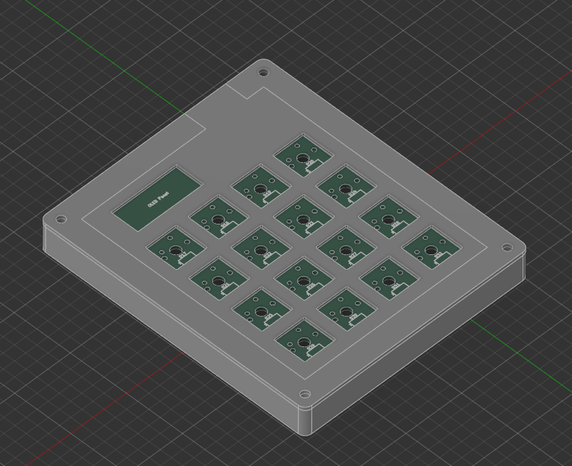
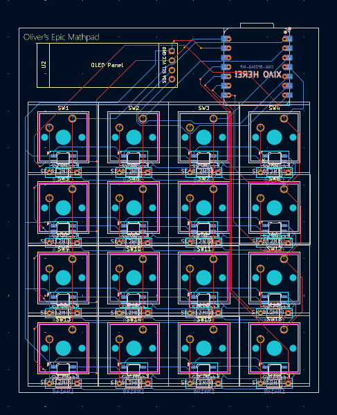
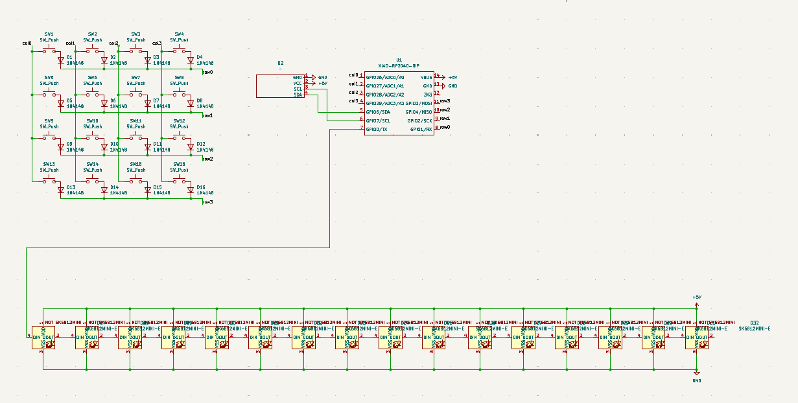

# MathPad – 4x4 Custom Mechanical Keypad

## Description

MathPad is a compact 4x4 mechanical keypad designed for fast numeric and math input.  
Its primary purpose is to provide a customizable keypad for productivity, coding, or creative projects.  
The keyboard features a Seeed XIAO RP2040 microcontroller, fully programmable firmware via KMK, and a small OLED display for dynamic feedback or animations.  

The device combines **mechanical switches**, **RGB LEDs**, and **3D printed case components** to create a functional, durable, and visually appealing pad.  

---

## Bill of Materials (BOM)

| Qty | Part | Description |
|-----|------|-------------|
| 1   | Seeed XIAO RP2040 | MCU with USB-C and GPIO pins |
| 16  | MX Mechanical Switches | 4x4 grid layout |
| 16  | Keycaps | Compatible with MX switches |
| 16  | 1N4148 Diodes | THT, one per switch for matrix isolation |
| 16  | SK6812 MINI-E LEDs | Addressable RGB LEDs for backlighting |
| 1   | 0.91" OLED Display | I2C 128x32 display for status/animations |
| 2   | 3D Printed Parts | Top and bottom case halves |
| 4   | M3x16mm Screws | Case assembly |
| 4   | Heatset Inserts | For threaded screw holes in the case |
| 1   | PCB | 4x4 keypad matrix with diodes and LED traces |

---

## Firmware

Firmware is written using **KMK (Keyboard Microcontroller Kit)** for Python.  
- Supports full key remapping and macros  
- Controls 16 SK6812 LEDs for animations  
- Updates the OLED display with custom text or image frames  

The firmware is stored in the `firmware/` folder and can be flashed directly to the Seeed XIAO RP2040.  

---

## CAD / Case

The case is designed in **3D CAD** for 3D printing.  

- Top and bottom halves include heatset inserts for M3 screws and mounting points for the PCB.  
- Case is optimized for a compact footprint while allowing easy assembly and maintenance.

---

## PCB & Schematic

PCB designed in **KiCad**.  

- 4x4 switch matrix with THT 1N4148 diodes for each switch  
- Integrated 16x SK6812 LEDs for backlighting  
- 0.91" I2C OLED display included  
- Seeed XIAO RP2040 mounted directly on PCB  
- All files (schematic and PCB layout) are included in the repository

---

## Conclusion

MathPad demonstrates a complete, custom 4x4 mechanical keypad project:  
- Hardware: PCB, mechanical switches, LEDs, and OLED  
- Firmware: Fully programmable Python KMK firmware  
- Case: 3D printed top and bottom halves  

It can be used for math input, shortcuts, creative coding, or as a base for custom keypad projects.  

All production-ready files, including **gerbers.zip** and STL case files, are included in the `Production/` folder for easy replication.
